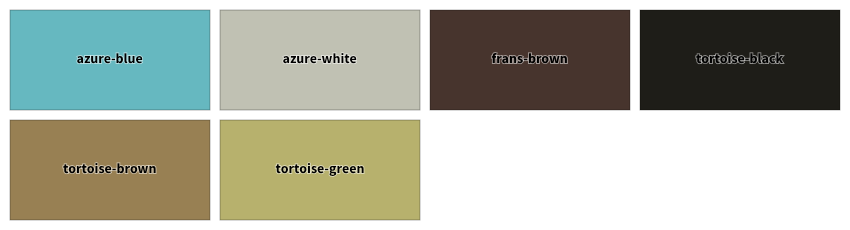
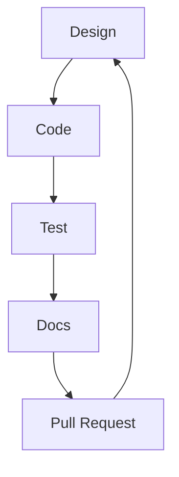

# Sfera UI
Building reusable user interfaces while experiment with different frameworks.

# Design System

[penpot](https://penpot.app/) will be utilised to come up with designs of the user interfaces 

## Colour Swatches

The aim is to have well defined colours to be used in the design system. The following colours can be obtained by upload [Penpot Colour Palette](designs/colour-palette.penpot) in your  Penpot workspace, pressing on Assets and press on publish. If more colours are to be utilised it is recommended to keep [Penpot Colour Palette](colour-palette.penpot) updated.

# Documentation

[docusaurus](https://docusaurus.io/docs) will be utilised for documentation

# Development Lifecycle

