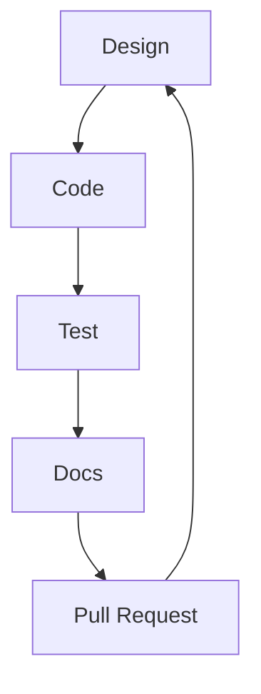

# Sfera UI
Building reusable user interfaces while experiment with different frameworks.

# Design System

[penpot](https://penpot.app/) will be utilised to come up with designs of the user interfaces 

# Documentation

[docusaurus](https://docusaurus.io/docs) will be utilised for documentation

# Development Lifecycle

